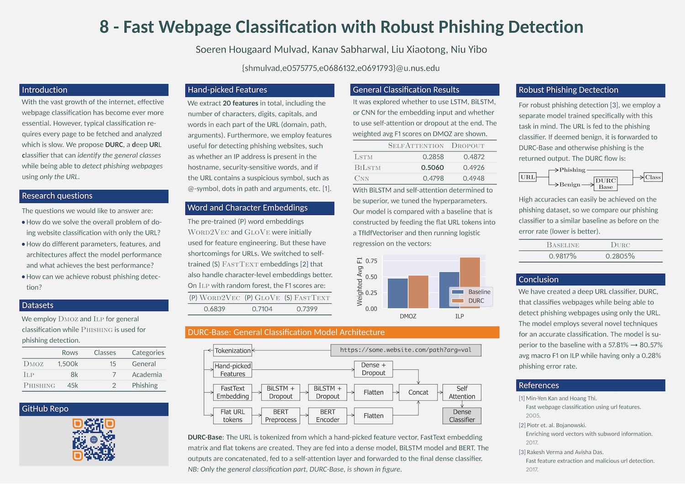

# NLP Project - Fast Webpage Classification with Robust Phishing Detection

Predicting webpages without the actual webpage. Project accessible at <https://github.com/shmulvad/nlp-project>. Summary of project:

[](./img/poster.pdf)


## Getting started with the code

To install dependencies, run

```bash
$ cd src
$ pip install -r requirements.txt
```

Before you can actually run most of the code, you need to download and organize the appropriate datasets. See [`src/data/README.md`][data-readme].


## Structure of code

### Reading the data

The datasets we use are structured in different ways. To streamline the code, they are all read and converted into the same format which is a DataFrame with the columns `[idx, url, label]`. The ILP dataset furthermore contains an `uni`-column but we ended up not using this in any of our code. The code for reading the data is located in `read_data.py`.


### Pre-processing

The main pre-processing code is located in the following files:

* [`util.py`][util]: Helper functions.
* [`url_tokenizer.py`][tokenizer]: Takes care of the tokenization of URLs and optionally reversing the path, multiword token expansion and acronym expansion.
* [`featurizer.py`][featurizer]: Contains the class for `UrlFeaturizer` which can be initialized with a given word embedding. Used in the following way:

```python
>>> from featurizer import UrlFeaturizer
>>> feat = UrlFeaturizer('GloVe')
>>> feat.featurize('http://example.com')
# Tuple of 1D ndarray of size 20 for hand-picked features and 31x300 word embed matrix
```

### One-off code

* [`pickle_data.py`][pickle_data]: Data to pickle the datasets. Was used to store on Google Drive to then easily read for usage in Google Colab.
* [`self_trained_embeddings.py`][self_trained_embeddings]: Trains FastText embeddings for the different datasets and writes them to disk. Was also uploaded to Google Drive for easy use in Goolge Colab.
* [`run_feat_experiments.ipynb`][run_feat_experiments]: Runs experiments on a Random Forest baseline model to see which hand-picked features matter the most.
* [`run_embed_comparison.ipynb`][run_embed_comparison]: The code used to get the comparision scores for different word embeddings ont the ILP dataset.


### Baselines

The baselines and plotting code for comparisons can be found in the [`baselines`][baselines]-folder.


### Models

The models are designed to be run on Google Colab and should be able to be run "as is" if uploaded. Note that they `!gdown` files we have stored on Google Drive. We do not guarantee these files will be available for all eternity. In that case, all the files used can be generated with the code here.

* [`SDEM.ipynb`][sdem]: SDEM model.
* [`DURC.ipynb`][durc]: DURC model (final model). 


### Example

[`demo.ipynb`][demo] shows some basic examples of how to read the data, the tokenization of the URLs, the initialization of the `UrlFeaturizer` and an example of returned output.


## Testing

This project uses `pytest` for testing. After having installed dependencies, you can simply run

```bash
$ pytest
```

to run all tests.


[data-readme]: ./src/data/README.md
[util]: ./src/util.py
[tokenizer]: ./src/url_tokenizer.py
[featurizer]: ./src/featurizer.py

[pickle_data]: ./src/pickle_data.py
[self_trained_embeddings]: ./src/self_trained_embeddings.py
[run_feat_experiments]: ./src/run_feat_experiments.ipynb
[run_embed_comparison]: ./src/run_embed_comparison.ipynb

[baselines]: ./src/baselines
[sdem]: ./src/models/SDEM.ipynb
[durc]: ./src/models/DURC.ipynb

[demo]: ./src/demo.ipynb
